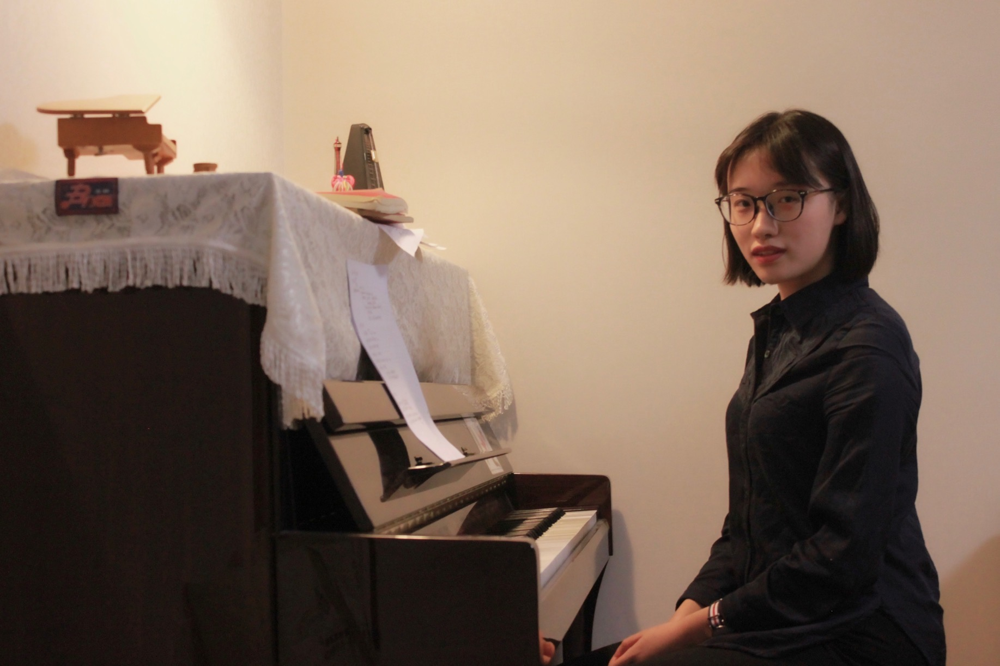

### Education / 教育背景

+ <a href="https://eecs.pku.edu.cn" target="_blank">School of Electronics Engineering and Computer Science</a> (信息科学技术学院)
  <a href="https://www.pku.edu.cn" target="_blank">Peking University</a> (北京大学)
+ <a href="http://www.xatyz.com/index.html " target="_blank">Xi'an Tie Yi High School</a> (西安市铁一中学)

### Contacts / 联系方式
+ <b>E-mail</b>: phoenixrain@pku.edu.cn
+ <b>GitHub</b>: <a href="https://github.com/phoenixrain-pku" target="_blank">phoenixrain-pku</a>

### Research / 科研
+  I am advised by <a href="https://cfcs.pku.edu.cn/people/faculty/xiaoyuan/index.htm" target="_blank">Xiao Yuan</a> (袁骁) and <a href="https://cs.pku.edu.cn/info/1082/1382.htm" target="_blank">Tong Yang</a> (杨仝).
+  Researching in <a href="https:/cfcs.pku.edu.cn/ " target="_blank">CFCS, Peking University</a> (北京大学前沿计算研究中心).
+ I am interested in Quantum Computing, Networking, Sketches and so on...

### Useful Skills / 有用的技能

+ 会写一点C、C++和LaTeX
+ 会用汉语和英语进行简单的沟通和写作
+ 会让钢琴发出声音
+ 会让小提琴发出噪音

### Useless Skills / 没用的技能

+ 可以轻松跑半马
+ 可以唱到D6
+ 喝咖啡必会把咖啡泼到衣服上
+ 一天能喝5瓶牛奶且吃5个橘子
+ 弹钢琴必篡改原谱

课余时间喜欢弹钢琴，唱歌，写小说/诗歌。除了音乐，还很喜欢文学，对我影响最大的诗人与作曲家分别是艾略特和柴可夫斯基。

研究方向还在探索，可能的兴趣与发展为network measurement, machine learning, theoretical computer science以及quantum computing。无法判断自己更喜欢学术还是艺术——虽然说我常常说自己“选择了学术道路，便再无资格为艺术而死”，但若问我为何而生，我觉得应当是艺术。毕竟从小到大都没搞清过自己到底想在学术上的具体哪个分支进行更深入的研究工作，但对艺术的热爱是与生俱来，且将生死与共的。因此便任由这二者在自己的生活中交织甚至肆虐，也不失为一件好事。

